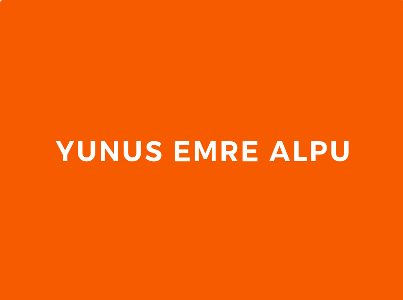
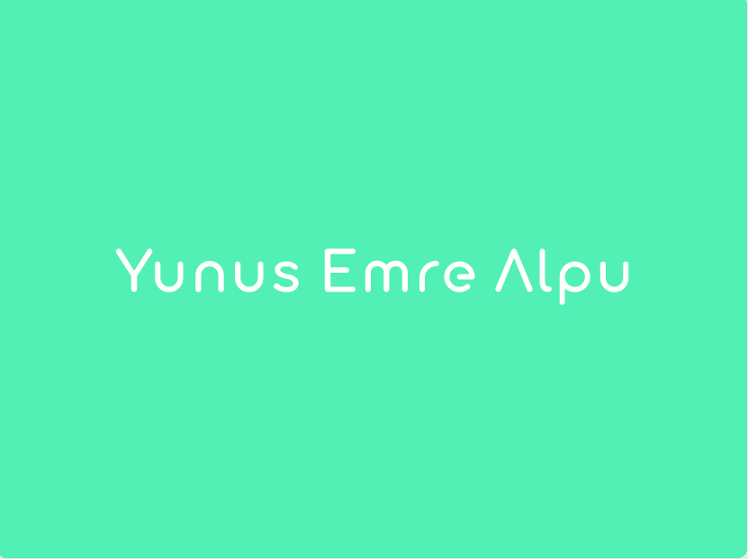
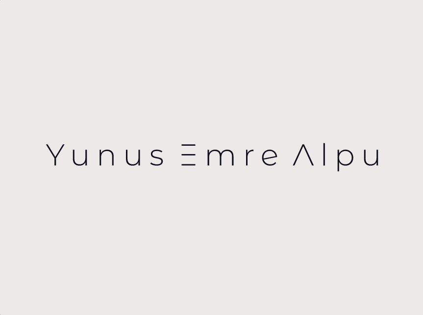

<!-- PROJECT LOGO -->
<br />
<p align="center">
  <a href="https://github.com/YunusEmreAlps/Flutter_Resume_App_UI/tree/master/my_resume">
    
    
    
  </a>

  <h3 align="center">Resume App</h3>

  <p align="center">
    You can create your own personal resume.
    <br />
    <a href="https://github.com/YunusEmreAlps/Flutter_Resume_App_UI/">Download</a>
    ·
    <a href="https://github.com/YunusEmreAlps/Flutter_Resume_App_UI/tree/master/my_resume/issues">Report Bug</a>
    ·
    <a href="https://github.com/YunusEmreAlps/Flutter_Resume_App_UI/tree/master/my_resume/issues">Request Feature</a>
  </p>
</p>

<!-- TABLE OF CONTENTS -->
<details open="open">
  <summary>Table of Contents</summary>
  <ol>
    <li>
      <a href="#about-us">About Me</a>
    </li>
    <li>
      <a href="#about-the-project">About The Project</a>
      <ul>
        <li><a href="#built-with">Built With</a></li>
      </ul>
    </li>
    <li>
      <a href="#getting-started">Getting Started</a>
      <ul>
        <li><a href="#prerequisites">Prerequisites</a></li>
        <li><a href="#clone">Clone</a></li>
      </ul>
    </li>
    <li><a href="#usage">Usage</a></li>
    <li><a href="#roadmap">Roadmap</a></li>
    <li><a href="#contributing">Contributing</a></li>
    <li><a href="#contact">Contact</a></li>
    <li><a href="#Screenshots">Screenshots</a></li>
  </ol>
</details>


<!-- ABOUT Me -->
## About Me
Hi, I'm Yunus Emre. I'm 21 years old from Konya. I'm a senior computer engineering student at Necmettin Erbakan University. I have learned the importance of applying classical strategies to modern-day projects. Software engineering is a never-ending puzzle that I am passionate about solving. This passion carried me through my education at Purdue. First, I learned C then C++. I studied new languages, algorithms, compilers, higher mathematics, all with pretty much the same fascination.

I want to improve myself because I only ever want to be judged on the strength of my abilities and paid for it. And I want to be able to explain myself clearly, and have people receptive to my ideas. I'm here to learn what I wonder and to share what I know. So, now, in industry, this passion remains with me. There’s certainly yet more to learn, yet more problems, and yet more to build.

<!-- ABOUT THE PROJECT -->
## About The Project
A sample Resume application with Flutter

1. You can create your own personal resume.
2. Work on both landscape and portrait mod
3. Pure Design
4. Multiple Language (TR - EN)


### Built With

* [Flutter](https://flutter.dev)


<!-- GETTING STARTED -->
## 🚀 Getting Started

### Prerequisites

To run any Android application built with Flutter you need to configure the enviroments in your machine, you can do this following the the tutorial provided by Google in [Flutter website](https://flutter.dev/docs/get-started/install)

- Flutter SDK
- Android Studio (to download Android SDK)
- Xcode (for iOS develop only)
- Any IDE with Flutter SDK installed (ie. IntelliJ, Android Studio, VSCode etc)
- A little knowledge of Dart and Flutter

### Clone

- Clone this repo to your local machine using:

```
git clone https://github.com/YunusEmreAlps/Flutter_Resume_App_UI.git
```

### Setup

To run the app you need to have an online emulator or a plugged device and run the following command in the root of the application (touch-flutter/app)

#### Android
```
flutter run
``` 
### iOS (_MAC Only_)

```
flutter run
``` 

<!-- ROADMAP -->
## Roadmap

See the [open issues](https://github.com/YunusEmreAlps/Flutter_Resume_App_UI/tree/master/my_resume/issues) for a list of proposed features (and known issues).


<!-- CONTRIBUTING -->
## 🤔 Contributing

Contributions are what make the open source community such an amazing place to be learn, inspire, and create. Any contributions you make are **greatly appreciated**.

1. Fork the Project
2. Create your Feature Branch (`git checkout -b feature/AmazingFeature`)
3. Commit your Changes (`git commit -m 'Add some AmazingFeature'`)
4. Push to the Branch (`git push origin feature/AmazingFeature`)
5. Open a Pull Request


<!-- LICENSE -->
## 📝 License

Distributed under the MIT License. See `LICENSE` for more information.


<!-- CONTACT -->
## 📌 Contact

- Linkedin at [Yunus Emre Alpu](https://www.linkedin.com/in/yunus-emre-alpu-5b1496151/)

<!-- SCREENSHOTS -->
## Screenshots

UI              |  UI               | UI               |  UI
:-------------------------:|:-------------------------:|:-------------------------:|:-------------------------:
||||

UI              |  UI               | UI               |  UI
:-------------------------:|:-------------------------:|:-------------------------:|:-------------------------:
||||

UI              |  UI               | UI               |  UI
:-------------------------:|:-------------------------:|:-------------------------:|:-------------------------:
||||

UI              |  UI               | UI               |  UI
:-------------------------:|:-------------------------:|:-------------------------:|:-------------------------:
|||

UI              |  UI               | UI               |  UI
:-------------------------:|:-------------------------:|:-------------------------:|:-------------------------:
|||